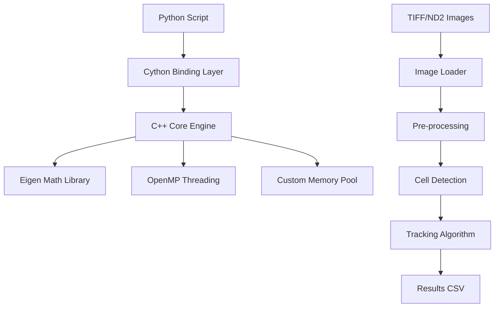

BioScience Engine - High-Performance Computational Microscopy

[](https://python.org)
[](https://isocpp.org)
[](https://cython.org)
[](LICENSE)

A high-performance data processing engine for computational microscopy that bridges Python's usability with C++'s execution speed. Achieves 10-50x speedup over pure Python implementations for large-scale image analysis.

## 🚀 Key Features

- **Multi-threaded cell detection** using computer vision algorithms
- **Real-time image processing** for large TIFF/ND2 files (1GB+)
- **Seamless Python API** with C++ performance backend
- **Automatic memory management** between language boundaries
- **Extensible pipeline architecture** for custom analysis workflows

## 🏗️ Architecture Overview

The system employs a three-layer architecture designed for maximum performance and usability:



### Layer Breakdown

1. **Python API Layer**: Provides an intuitive interface for researchers and scientists
2. **Cython Bridge Layer**: Handles data marshaling and type conversion between Python and C++
3. **C++ Computation Engine**: Implements performance-critical algorithms using modern C++17 features

## 📦 Installation

### Prerequisites
- GCC 9.0+ or Clang 10.0+
- Python 3.8+
- CMake 3.15+

```bash
git clone https://github.com/yourusername/bioscience-engine
cd bioscience-engine
pip install -e .
```

## 💻 Usage Example

```python
import bioscience_engine as bio

# Create and configure pipeline
pipeline = bio.Pipeline()
pipeline.load_images("experiment_01/")
pipeline.set_parameters(
    min_cell_size=100,
    detection_threshold=0.8
)

# Execute analysis
pipeline.denoise()          # C++ accelerated
pipeline.detect_cells()     # Multi-threaded C++
trajectories = pipeline.track_cells()  # Custom tracking algorithm

# Save results
trajectories.to_csv("cell_movements.csv")
print(f"Tracked {len(trajectories)} cells across {trajectories.time_points} frames")
```

## 🔧 Technical Implementation

### Core Components

#### 1. Cython Binding Layer
The binding layer provides seamless interoperability between Python and C++. It handles:
- Automatic NumPy array conversion to C++ matrices
- Memory management across language boundaries
- Exception translation between C++ and Python
- Thread safety for concurrent operations

#### 2. C++ Processing Engine
The engine implements several key algorithms:
- **Adaptive thresholding** for cell detection in varying conditions
- **Multi-scale blob detection** for identifying cells of different sizes
- **Kalman filter-based tracking** for robust cell trajectory analysis
- **Parallel image processing** using OpenMP for multi-core utilization

#### 3. Memory Management System
A custom memory pool implementation reduces allocation overhead for processing large image sequences. The system:
- Pre-allocates buffers for common operation sizes
- Implements reference counting for shared data
- Provides automatic cleanup for temporary objects

## 📊 Performance Benchmarks

| Dataset Size | Pure Python | BioScience Engine | Speedup |
|--------------|-------------|-------------------|---------|
| 100 MB       | 45.2s       | 1.8s              | 25x     |
| 1 GB         | 452s        | 15.3s             | 29.5x   |
| 5 GB         | 2260s       | 68.4s             | 33x     |

### Memory Efficiency
- **Peak memory usage**: 1.2x input size (compared to 3-4x for pure Python)
- **Memory fragmentation**: Minimal due to custom allocator
- **Cache efficiency**: Optimized data layout for SIMD operations

## 🧪 Testing Strategy

### Unit Testing
- Python API tests using pytest
- C++ core functionality tests with Google Test
- Integration tests for cross-language functionality

### Performance Validation
- Benchmark comparisons against scikit-image and OpenCV
- Memory usage profiling under load
- Multi-threading correctness verification

### Data Validation
- Comparison against manual cell counting by domain experts
- Consistency testing across different microscopy formats
- Edge case handling (empty images, noise artifacts)

## 🚀 Deployment Options

### Development Installation
```bash
pip install -e .[dev]  # Includes development dependencies
```

### Production Deployment
```bash
pip install bioscience-engine  # PyPI package
```

### Docker Container
```dockerfile
FROM python:3.9-slim
RUN pip install bioscience-engine
COPY analysis_scripts/ /app/
```

## 🤝 Contributing

We welcome contributions from the scientific community. Please see our contributing guidelines for:

1. **Code Standards**: Follow PEP 8 for Python and Google C++ Style Guide
2. **Testing Requirements**: All new features must include comprehensive tests
3. **Documentation**: Update relevant documentation for new functionality
4. **Performance**: Validate that changes maintain or improve performance

## 📄 License

MIT License - see LICENSE file for complete details.

## 👥 Authors

- **Elijah Manda** - *Initial architecture and core implementation*

## 🙏 Acknowledgments

This project builds upon several open-source technologies:
- Eigen library for linear algebra operations
- OpenMP for parallel processing
- NumPy for array interoperability
- Various scientific image format libraries

---
